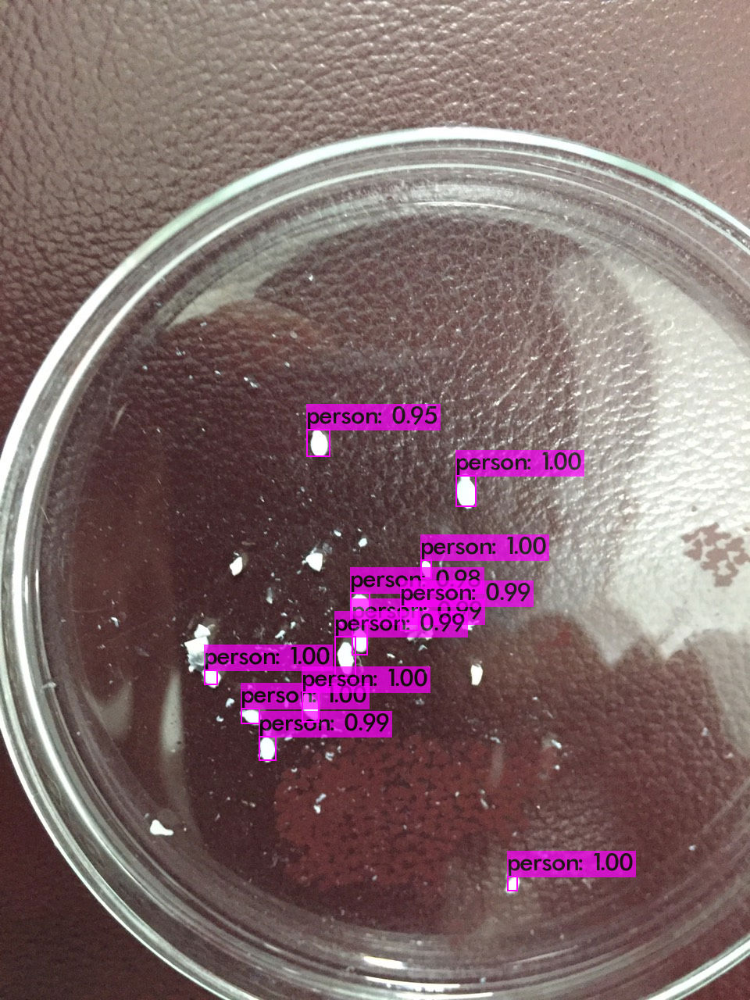

# ObjectDetection

## How to install Yolo4
### cmake
    sudo apt install cmake
    cmake -version
cmake version 3.18.4
### opencv
    sudo apt install libopencv-dev python3-opencv
    opencv_version
4.5.1
### openmp
    sudo apt install libomp-dev git g++
### YOLO4
    git clone https://github.com/AlexeyAB/darknet
    cd darknet
    mkdir build_release
    cd build_release
    cmake .. -DENABLE_CUDA=OFF
    make
    cp libdarknet.so ../
    cp darknet ../
    cd ../
    mv darknet yolov4
 #### Testing!
 ##### ./darknet detect xxx.cfg xxx.weight xxx.jpg
    cd yolov4
    ./darknet detect ../../Neobennia/yolov3_testing.cfg ../../Neobennia/yolov3_training_last.weights ../../Neobennia/Neobennia_2.jpg
##### Result
    ./../Neobennia/Neobennia_2.jpg: Predicted in 16782.047000 milli-seconds.
        person: 100%
        person: 100%
        person: 99%
        person: 100%
        person: 95%
        person: 99%
        person: 98%
        person: 99%
        person: 99%
        person: 100%
        person: 100%
        person: 100%

# CAUTION!
I trained model by google colab using yolov3 and I had 2 files: yolov3_testing.cfg and yolov3_training_last.weights.
HOWEVER, IF I USE YOLOV3 TO DETECTING, I WILL ONLY HAVE RESULT BY TEXT (NOT IMAGE LIKE V4)

    cd yolov3
    ./darknet detect ../../Neobennia/yolov3_testing.cfg ../../Neobennia/yolov3_training_last.weights ../../Neobennia/Neobennia_2.jpg
   
        person: 100%
        person: 100%
        person: 99%
        person: 100%
        person: 95%
        person: 99%
        person: 98%
        person: 99%
        person: 99%
        person: 100%
        person: 100%
        person: 100%
        
 # IMPORTANT
 ## YOU MUST DOWNLOAD *.cfg *.last.weight FROM YOUR GOOGLE DRIVE AFTER TRAINING MODEL FROM GOOGLE COLAB
