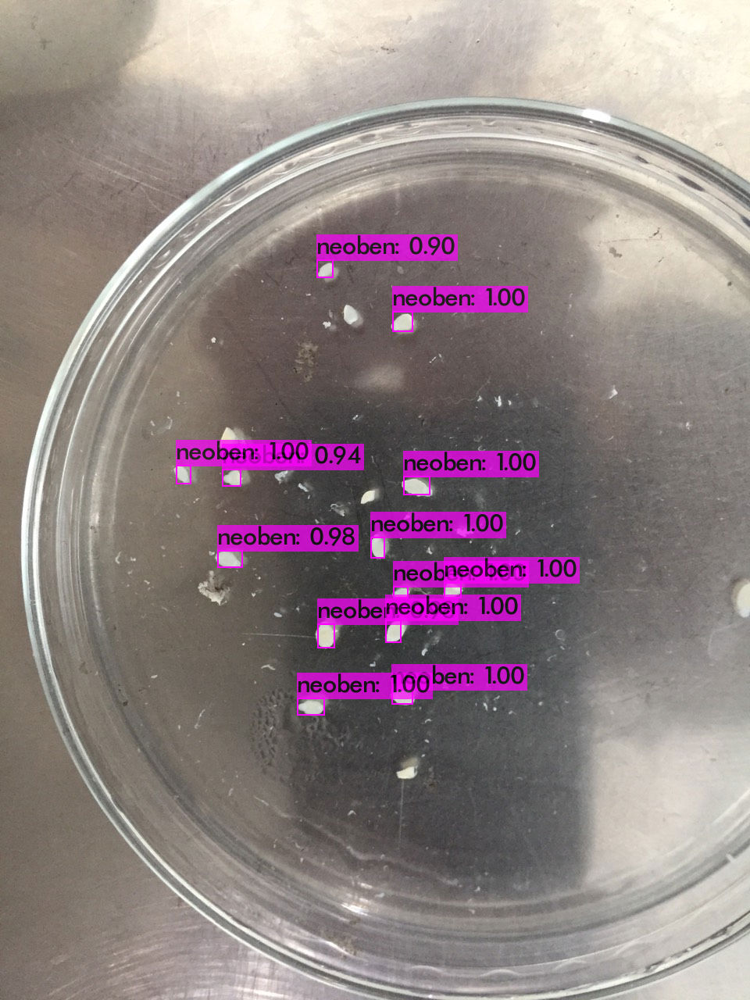

# ObjectDetection

## How to install Yolo4
### cmake
    sudo apt install cmake
    cmake -version
cmake version 3.18.4
### opencv
    sudo apt install libopencv-dev python3-opencv
    opencv_version
4.5.1
### openmp
    sudo apt install libomp-dev git g++
### YOLO4
    git clone https://github.com/AlexeyAB/darknet
    cd darknet
    mkdir build_release
    cd build_release
    cmake .. -DENABLE_CUDA=OFF
    make
    cp libdarknet.so ../
    cp darknet ../
    cd ../
    mv darknet yolov4
 #### Testing!
 ##### ./darknet detect xxx.cfg xxx.weight xxx.jpg
    cd yolov4
    ./darknet detect ../../Neobennia/yolov3_testing.cfg ../../Neobennia/yolov3_training_last.weights ../../Neobennia/Neobennia_2.jpg
##### Result

